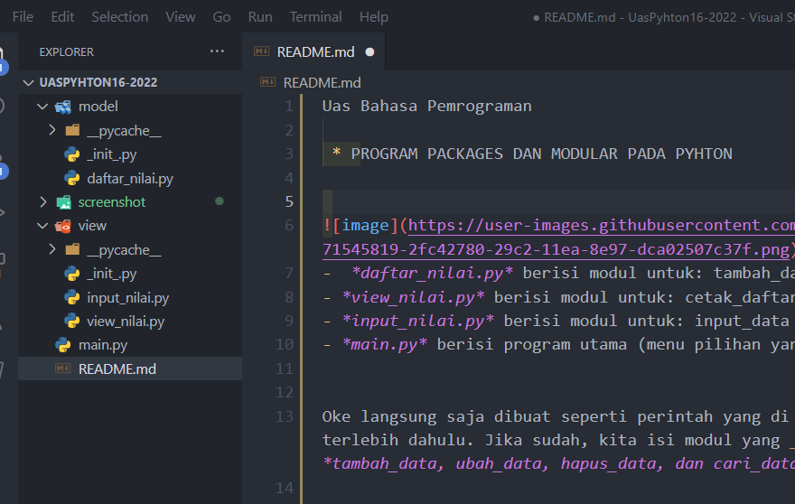
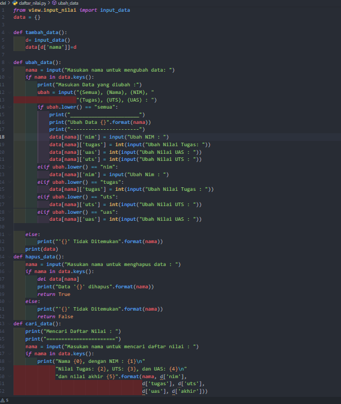
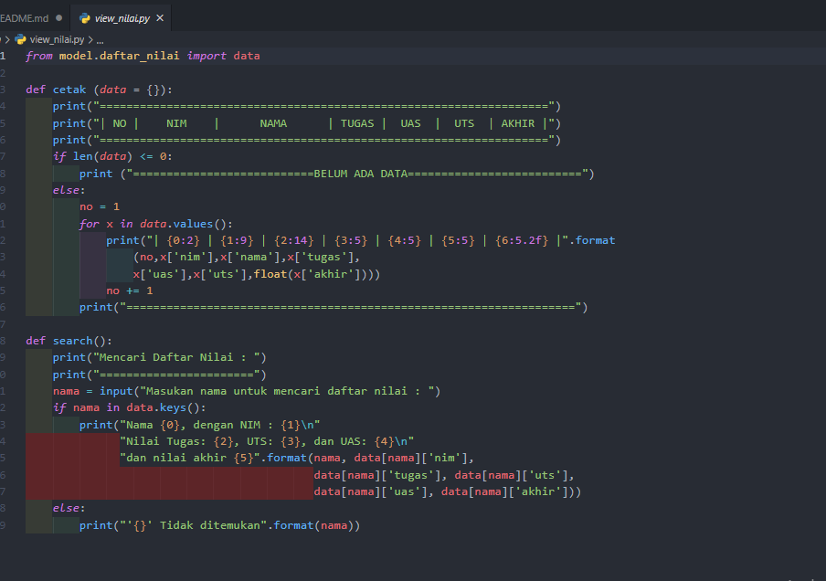
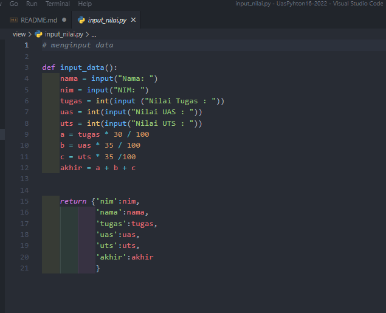
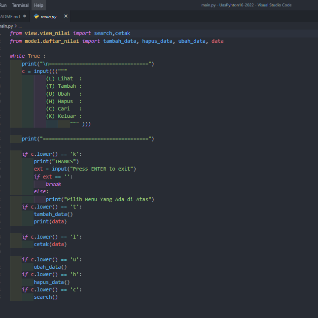

Uas Bahasa Pemrograman 

 * PROGRAM PACKAGES DAN MODULAR PADA PYHTON

-  *daftar_nilai.py* berisi modul untuk: tambah_data, ubah_data, hapus_data, dan cari_data
- *view_nilai.py* berisi modul untuk: cetak_daftar_nilai, cetak_hasil_pencarian!
- *input_nilai.py* berisi modul untuk: input_data yang meminta pengguna memasukkan data 
- *main.py* berisi program utama (menu pilihan yang memanggil semua menu yang ada)

Oke langsung saja dibuat seperti perintah yang di atas, buat package dan modulnya terlebih dahulu. Jika sudah, kita isi modul yang __daftar_nilai.py__ beriskan : *tambah_data, ubah_data, hapus_data, dan cari_data.* Berikut Screnshoot programnya.

Lalu buat package view, package view berisi modul __view.nilai.py__ yang berisikan cetak_daftar_nilai, cetak_hasil_pencarian!. Berikut Screnshoot programnya.

Kemudian buat file dengan format *input_nilai* yang berisikan __input_nilai__ yang meminta pengguna memasukan data

Yang terakhir  buatlah file dengan format *main.py*, file ini berfungsi untuk menu pilihan yang memanggil semua yang ada atau program utamanya.

